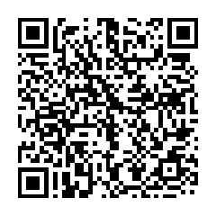
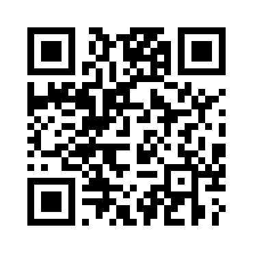

# Support FaceChan

FaceChan is free software, MIT licensed, built and maintained by one person in their spare time. It will always be free. There is no hosting to pay for, no infrastructure to fund — just time.

If you find it useful and want to say thanks, a Monero donation is appreciated.

---

## Monero (XMR)

**Address:**
```
45EsvXBYfUr5hNEUMfnp34ghn6ENNXNnKHcBqhF4YkQXAxpDSa6MMoCefQgj9c5oQJb1SUicGLTTN1xRzCk4vDHf7DWeeMG
```



## Bitcoin (BTC)

**Address:**
```
bc1q6jka3q0x9k37y37a26mmygru9j0rc48q7nrudg
```



---

No KYC. No accounts. No strings.

Lightning address will be added when available.
